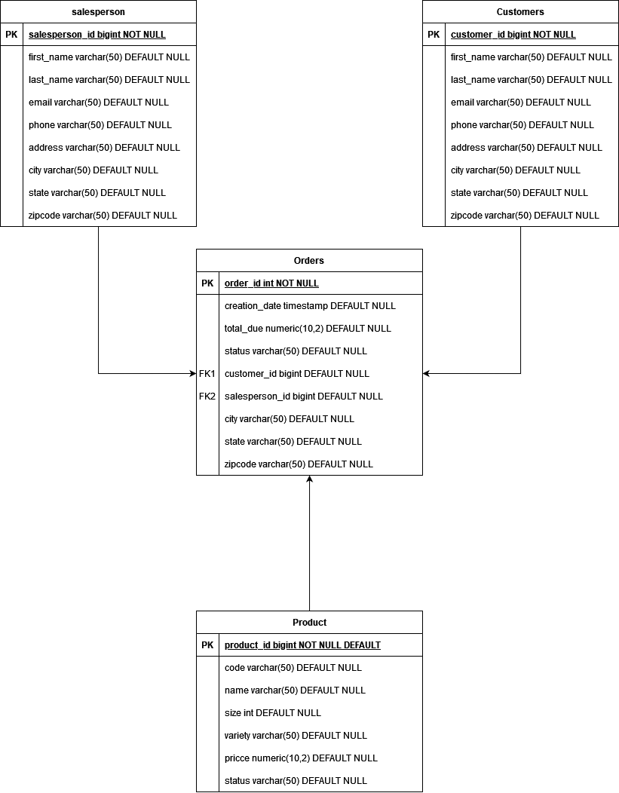

# Introduction
This application is designed to manipulate entries within a pre-existing PSQL database.
It utilizes Maven to build the entire project and JDBC to access the database. The program contains
the basic CRUD operations. This database setup follows the Data Access Object(DAO) pattern.
This allows better operation of the different tables within the database and allows you to
perform the operations as necessary.

# Implementaiton
## ER Diagram


## Design Patterns
Both DAO and repository design patterns are very similar however as you begin to work on complex
databases, the differences will begin to appear. Both methods will abstract data access however
DAO will simplify the data from storage hiding queries and return the request with the data in the object state. Repository patterns will sit at a higher level in the hierarchy and hide data
but it will return a business domain object. It can then use a DAO to return it as a
business object instead. Repository design patterns focus only on single table access per class
while DAO can deal with multiple table access per class. Repository databases also allow you to
shard the data so you don't need to load the entire table to view the data. Allowing for
better performance with vertically scalable data. However, Repository patterns cannot deal with
atomic transactions. They will require extra support to deal with atomic transactions making it easier to get the job done with a DAO pattern.


# Test
Within JDBCExecutor.java you can set whatever methods you want to perform to the Database.
First change the first variable within main, DCM, to the correct fields of the database you want
to manipulate in the format of a host, database, username, and lastly password. Then build it using
`mvn clean install`. Afterwards, you can run it using
```bash
java -jar target/JDBC-1.0-SNAPSHOT.jar
```
